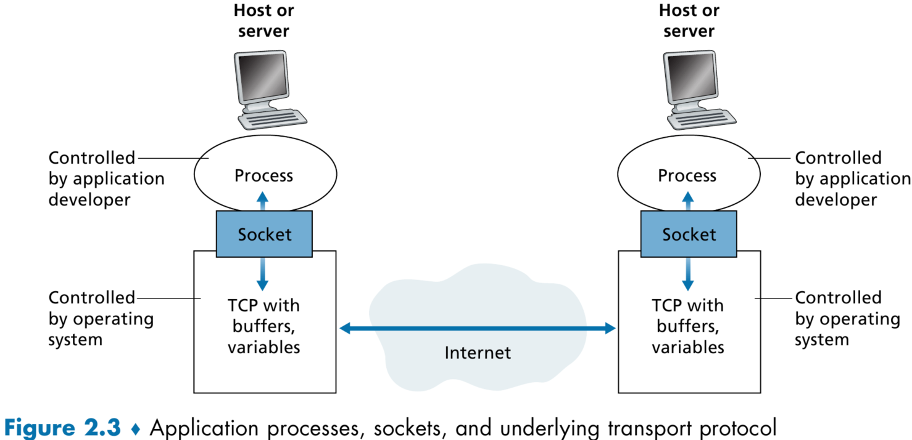

# 2.1 Principles of Network Applications

- 네트워크 애플리케이션을 만든다고 한다면, 모든 end system에서 실행되게 만들어야 한다.
    - 네트워크 응용 프로그램?
        - 인터넷을 사용해 다른 장치와 통신하며 사용하는 애플리케이션
- 그렇다고 router나 link-layer switch 같은 네트워크 코어 장비에서까지 실행되기 만들 필요는 없다.
    - 네트워크 코어에 애플리케이션을 만들 수도 없고 그럴 필요도 없다.
    - 네트워크 코어 장비는 앱은 필요 없고 필요한 프로그램이 내장되어 있다.
    - 네트워크 코어 장비는 애플리케이션 레이어에서 기능하지 않고 그 밑의 레이어에서 기능한다.
- 애플리케이션은 애플리케이션 레이어에서만 동작한다.
    - 응용 소프트웨어를 엔드 시스템에만 국한시키는 구조 덕분에 다양한 네트워크 애플리케이션을 빠르게 개발하고 배포할 수 있다.

## 2.1.1 Network Application Architectures

- 네트워크 애플리케이션 아키텍처
    - client-server architecture
        - 수많은 클라이언트에서 요청을 처리하는 서버
        - 브라우저의 요청을 처리하는 항상 돌아가고 있는 웹 서버
            - 이때 클라이언트 끼리는 직접 통신하지 않는다.
        - 서버는 고정 IP 주소를 갖는다.
        - Web, FTP(File Transfer Protocol), Telnet, e-mail
        - 싱글 서버로는 모든 요청을 처리할 수 없다.
            - 그래서 유명 앱들은 데이터 센터에 가상 서버 여러 대를 만들어 대응한다.
                - 구글은 전 세계 19개의 데이터 센터를 운영한다.
    - peer-to-peer architecture(p2p)
        - 전용 서버에 대한 의존도가 없거나 낮다.
        - peer라고 불리는 호스트끼리 직접 연결되어 통신한다.
        - 각 peer들은 서비스 운영자가 소유하는 것이 아니라 집, 대학, 사무실의 사용자들이 컴퓨터로 관리한다.
        - 서버를 거치지 않는다.
        - BitTorrent 같은 파일 공유 앱
        - 가장 매력적인 특징은 self-scalability(자체 확장)이다.
            - 사용자가 많아질수록 성능이 좋아진다.
        - 서버 관련 비용이 안 들어 비용 효율적이다.
        - 대신 집중화 되지 않은 구조 때문에 안전, 성능, 안정성에 대한 이슈가 있다.

## 2.1.2 Processes Communicating

- 운영 체제에서는 수많은 프로그램들이 실행되고 서로 통신한다.
- 사실 진짜 통신하는 것은 프로세스이다.
    - 같은 엔스 시스템 내에서 실행되면 운영체제에 의해 통신 가능하다.
- 그럼 프로세스가 다른 엔드 시스템의 프로세스와 소통할 수 있을까?
    - 프로세스는 기본적으로 메세지를 통해 통신한다.

### Client and Server Processes

- 네트워크 애플리케이션은 네트워크에서 메세지를 주고받는 프로세스 쌍으로 구성된다.
    - 브라우저 - 웹 서버
    - 피어 ↔ 피어
    - 클라이언트 - 서버
        - 통신을 시작하는 쪽이 클라이언트, 접속을 기다리는 쪽이 서버

### The Interface Between the Process and the Computer Network

- 프로세스는 메세지로 통신하며, socket이라는 interface를 통해 메세지를 주고 받는다.
- 프로세스 → 집, socket → 문
    - 메세지를 전송하는 프로세스가 메세지를 문(socket)에 던지면, 메세지가 전송 과정을 거쳐 메세지를 받는 프로세스의 문(socket)에 던져 놓고 목적지의 받는 프로세스가 메세지를 처리한다.
        
        
        
        - 애플리케이션이 메세지를 socket을 통해 transport layer로 내려보낸다.
        - 애플리케이션과 네트워크를 연결하는 API
            - socket은 네트워크 애플리케이션에 구현된 프로그래밍 인터페이스이다.
        - 앱 개발자는 소켓의 application layer 부분을 제어하고, transport layer 부분에서는 (1)프로토콜 TCP, UDP를 선택하거나, (2)전송 파라미터 몇 개를 설정할 수 있다.

### Addressing Processes

- 통신을 하려면 주소를 알아야 한다.
    - 수신 호스트 주소
        - IP 주소
    - 수신 호스트의 수신 프로세스를 특정하는 식별자
- 송신 프로세스도 수신 측 프로세스, 정확히는 소켓을 식별해야 한다.
    - 보통 호스트들은 많은 애플리케이션을 실행한다
        - 목적지 식별을 위해 port number가 필요하다.
            - ex) web server : 80, mail server : 25

## 2.1.3 Transport Services Available to Applications

- 네트워크 애플리케이션은 요구 사항에 맞게 데이터를 전송할 수 있도록 구현되어야 한다.
    - 이 말은 즉, transport layer의 서비스들을 적절하게 선택해야 한다는 의미이다.

### Reliable Data Transfer

- reliable data transfer
    - 데이터가 모두 에러 없이 목적지에 도착함을 보장한다.
- loss-tolerant applications
    - 데이터 손실이 발생한다.
    - 멀티미디어 애플리케이션은 보통 데이터 손실이 큰 영향을 미치지 않는다.

### Throughput

- 어느 앱 하나만 대역폭을 사용하는 게 아니기 때문에 처리량(througput)은 시간 별로 달라질 수 있다.
- bandwidth-sensitive applications
    - 처리량에 민감한 앱
        - 처리량이 낮아지면 품질이 떨어지거나 아예 통신이 끊길 수 있다.
    - Internet telephny, 인터넷 전화 서비스
- elastic applications
    - 처리량이 낮아져도 품질이 떨어지는 게 아니라 처리량에 따라 속도 변화만 있을 뿐이다.
        - 파일 전송, 이메일 전송 등

### Timing

- 데이터가 얼마나 빨리 목적지까지 도달하는 지가 중요하다.
- 실시간 화상회의나 온라인 게임에서 딜레이가 발생하면 서비스 질이 떨어진다.

### Security

- 전송 계층 프로토콜은 데이터를 암호화·복호화해 기밀성을 제공하며, 데이터 변조를 막는 무결성과 통신 당사자를 검증하는 인증 서비스도 제공한다.

## 2.1.4 Transport Services Provided by the Internet
- 네트워크 애플리케이션을 개발할 때 가장 먼저 결정해야 하는 것은 UDP, TCP를 선택하는 것이다.

### TCP Services

- 연결 지향 서비스
    - Handshaking
        - TCP는 애플리케이션에서 메시지를 주고 받기 전에 클라이언트와 서버가 전송 계층의 정보를 주고 받아 패킷의 유입에 대비한다.
    - 양방향 연결
        - 두 프로세스, 송신 수신 프로세스가 항상 연결된 상태로 서로 메세지를 주고 받을 수 있다.
        - 메시지 전송 간 세션 유지
    - 메세지 전송이 끝나면 세션 종료
- 신뢰할 수 있는 데이터 전송 서비스
    - 모든 데이터를 에러 없이 빠지거나 중복된 데이터 없이 적절한 순서로 전송 가능하다.
    - 혼잡 제어가 가능하다.
        - 슬로우 스타터로 시작해서 점점 전송 속도를 높이다가 정체가 발생하면 줄이는 식이다.

### UDP Services

- 간소화된 서비스로 최소한의 전송 서비스만 제공한다.
- TPC와 달리 handshaking도 없고, 연결을 유지하지도 않는다.
- 데이터가 수신 프로세스까지 도달하는 것과 순서를 보장하지 않는다.
- 혼잡 제어 메커니즘이 없다.

### Services Not Provided by Internet Transport Protocols

- UDP가 완벽히 타이밍이나 처리량을 보증하지는 않고, 서비스를 제공하지 않는 대신 최소한의 오버헤드로 빠른 전송이 가능해서, 일부 애플리케이션에서 TCP 대신 선택된다.
